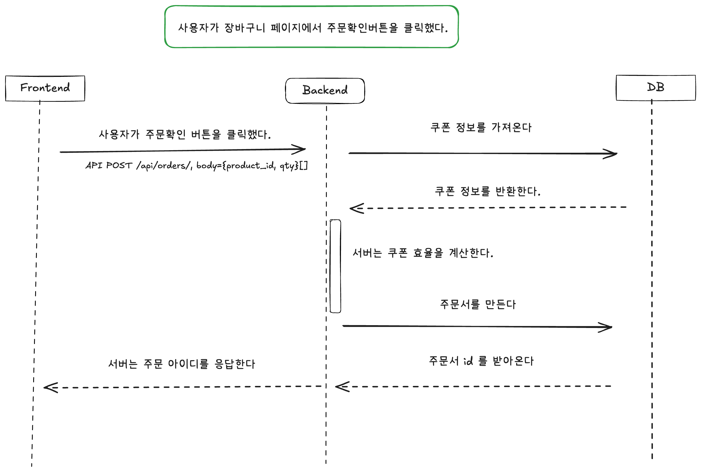
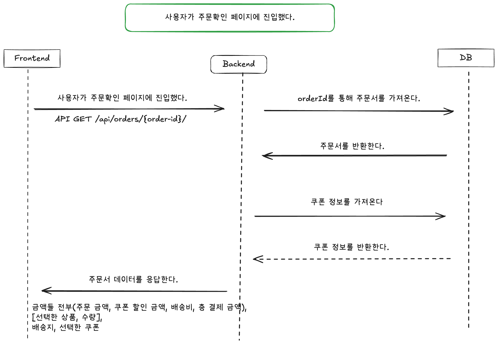
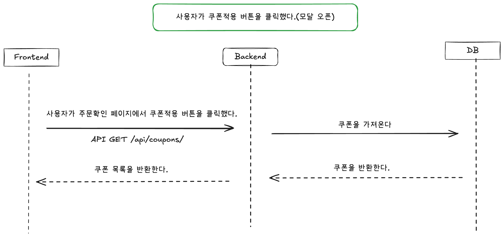
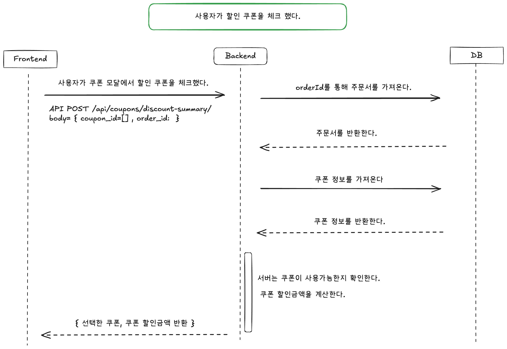
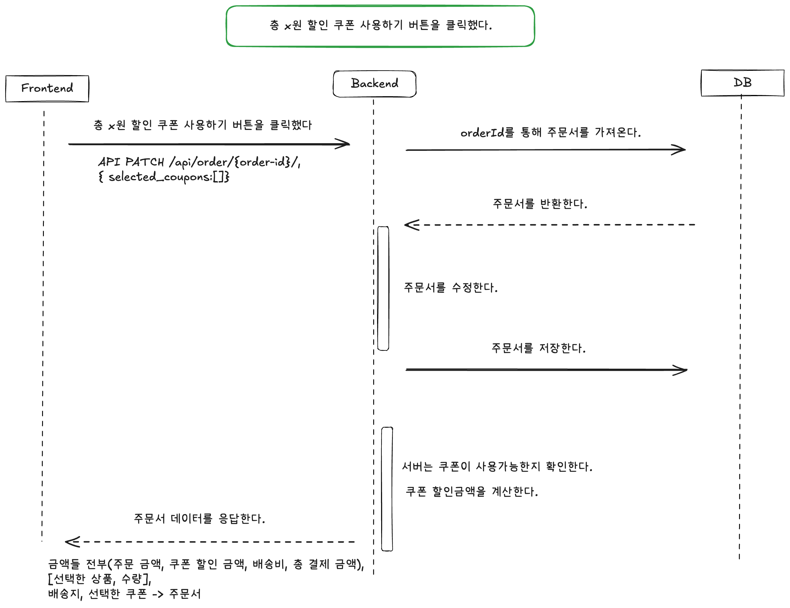
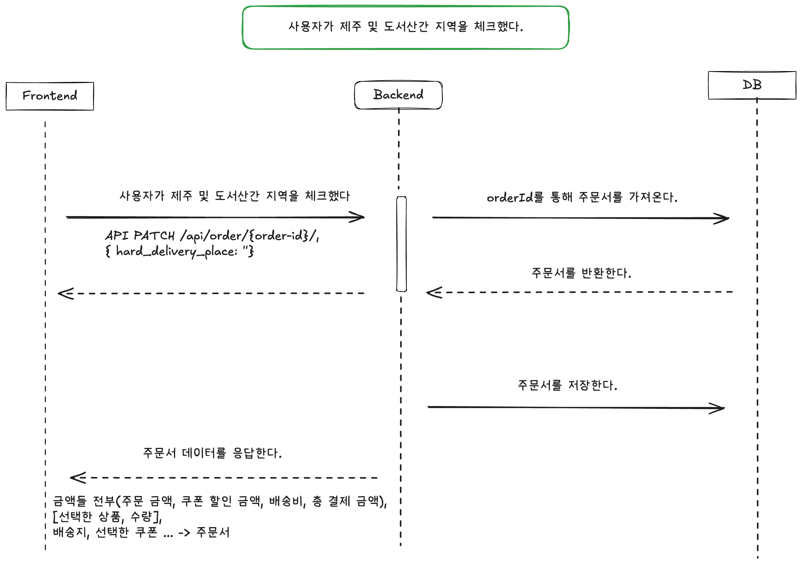
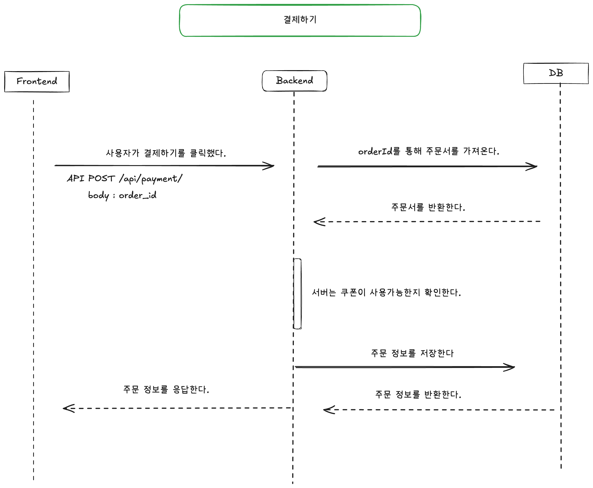

# 시스템 디자인 ⭐️

장바구니라는 도메인에서 결제하기와 같이 데이터가 중요한 부분에서는 최대한 DB와의 접근을 통해 정합성을 챙기려고 했습니다.

그래서 할인쿠폰이나 도서산간 지역 체크를 주문서에 포함시켜 DB에 저장하도록 했습니다.

최대한 클라이언트에서 이벤트를 중심으로 다이어그램을 작성하였습니다.

---

## 사용자가 장바구니 페이지에서 주문확인 버튼을 클릭했다.

## 사용자가 주문확인 페이지에 진입했다.

## 사용자가 쿠폰적용 버튼을 클릭했다. (모달 오픈)

## 사용자가 할인 쿠폰을 체크했다.

## 사용자가 총 xx 원 할인 쿠폰 사용하기 버튼을 클릭했다.

## 사용자가 제주 및 도서산간 지역을 체크했다.

## 사용자가 결제하기 버튼을 클릭했다.

